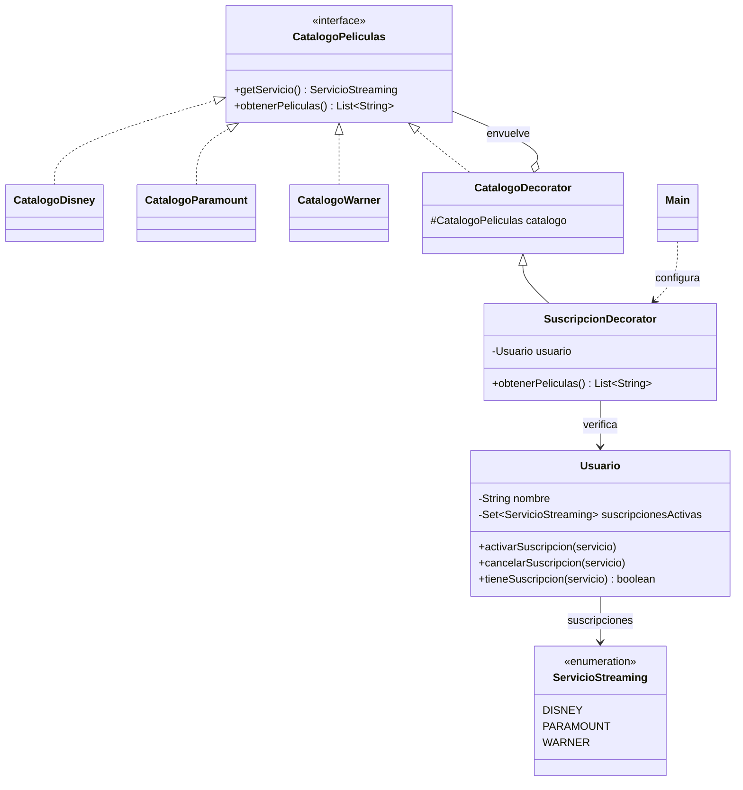

## El Patrón Decorator

### Contexto del Problema

Una plataforma ofrece catálogos de películas de Disney, Paramount y Warner. Cada usuario puede tener distintas suscripciones activas y solo debe consultar los catálogos incluidos en ellas.

Implementar toda la lógica de acceso dentro de cada catálogo mezcla responsabilidades. Crear una subclase diferente para cada combinación de catálogo y suscripción también produciría muchas clases. El patrón Decorator permite envolver un catálogo con una capa que verifica el acceso, manteniendo la misma interfaz.

### Tu Tarea: Controlar el acceso a catálogos con Decorator

El ejemplo Java de este directorio muestra una solución completa. Revisa las clases y sigue el flujo desde `Main`.

#### Instrucciones Paso a Paso:

1. **Define el componente:** `CatalogoPeliculas` declara las operaciones comunes para consultar el servicio y obtener sus películas.

   **Solución (`CatalogoPeliculas.java`):**
   ```java
   import java.util.List;

   public interface CatalogoPeliculas {
       ServicioStreaming getServicio();

       List<String> obtenerPeliculas();
   }
   ```

2. **Crea los componentes concretos:** `CatalogoDisney`, `CatalogoParamount` y `CatalogoWarner` implementan la interfaz y proporcionan sus películas.

   **Solución (`CatalogoDisney.java`):**
   ```java
   import java.util.List;

   public class CatalogoDisney implements CatalogoPeliculas {
       @Override
       public ServicioStreaming getServicio() {
           return ServicioStreaming.DISNEY;
       }

       @Override
       public List<String> obtenerPeliculas() {
           return List.of("El rey leon", "Toy Story", "Frozen");
       }
   }
   ```

   **Solución (`CatalogoParamount.java`):**
   ```java
   import java.util.List;

   public class CatalogoParamount implements CatalogoPeliculas {
       @Override
       public ServicioStreaming getServicio() {
           return ServicioStreaming.PARAMOUNT;
       }

       @Override
       public List<String> obtenerPeliculas() {
           return List.of("Top Gun: Maverick", "Sonic", "Un lugar en silencio");
       }
   }
   ```

   **Solución (`CatalogoWarner.java`):**
   ```java
   import java.util.List;

   public class CatalogoWarner implements CatalogoPeliculas {
       @Override
       public ServicioStreaming getServicio() {
           return ServicioStreaming.WARNER;
       }

       @Override
       public List<String> obtenerPeliculas() {
           return List.of("Harry Potter", "Batman", "Duna");
       }
   }
   ```

3. **Crea el decorador base:** `CatalogoDecorator` también implementa `CatalogoPeliculas`, conserva una referencia a otro catálogo y delega sus operaciones.

   **Solución (`CatalogoDecorator.java`):**
   ```java
   import java.util.List;

   public abstract class CatalogoDecorator implements CatalogoPeliculas {
       protected final CatalogoPeliculas catalogo;

       protected CatalogoDecorator(CatalogoPeliculas catalogo) {
           this.catalogo = catalogo;
       }

       @Override
       public ServicioStreaming getServicio() {
           return catalogo.getServicio();
       }

       @Override
       public List<String> obtenerPeliculas() {
           return catalogo.obtenerPeliculas();
       }
   }
   ```

4. **Añade la responsabilidad de suscripción:** `SuscripcionDecorator` envuelve un catálogo y un usuario. Antes de devolver las películas, comprueba que el usuario tenga activa la suscripción correspondiente. Si no la tiene, deniega el acceso.

   **Solución (`SuscripcionDecorator.java`):**
   ```java
   import java.util.List;

   public class SuscripcionDecorator extends CatalogoDecorator {
       private final Usuario usuario;

       public SuscripcionDecorator(CatalogoPeliculas catalogo, Usuario usuario) {
           super(catalogo);
           this.usuario = usuario;
       }

       @Override
       public List<String> obtenerPeliculas() {
           ServicioStreaming servicio = getServicio();
           if (!usuario.tieneSuscripcion(servicio)) {
               throw new IllegalStateException(
                       usuario.getNombre() + " no tiene activa la suscripcion de " + servicio.getNombre());
           }

           return super.obtenerPeliculas();
       }
   }
   ```

5. **Modela las suscripciones del usuario:** `Usuario` permite activar, cancelar y consultar suscripciones de Disney, Paramount y Warner.

   **Solución (`ServicioStreaming.java` y `Usuario.java`):**
   ```java
   public enum ServicioStreaming {
       DISNEY("Disney"),
       PARAMOUNT("Paramount"),
       WARNER("Warner");

       private final String nombre;

       ServicioStreaming(String nombre) {
           this.nombre = nombre;
       }

       public String getNombre() {
           return nombre;
       }
   }
   ```

   ```java
   import java.util.EnumSet;
   import java.util.Set;

   public class Usuario {
       private final String nombre;
       private final Set<ServicioStreaming> suscripcionesActivas = EnumSet.noneOf(ServicioStreaming.class);

       public Usuario(String nombre) {
           this.nombre = nombre;
       }

       public String getNombre() {
           return nombre;
       }

       public void activarSuscripcion(ServicioStreaming servicio) {
           suscripcionesActivas.add(servicio);
       }

       public void cancelarSuscripcion(ServicioStreaming servicio) {
           suscripcionesActivas.remove(servicio);
       }

       public boolean tieneSuscripcion(ServicioStreaming servicio) {
           return suscripcionesActivas.contains(servicio);
       }
   }
   ```


### Ejecutar el ejemplo

Desde este directorio, compila y ejecuta las clases:

```bash
javac *.java
java Main
```

El usuario de ejemplo tiene Disney y Warner activos, por lo que puede consultar esos catálogos. El intento de consultar Paramount es denegado. Al activar Paramount y volver a intentarlo, el acceso se permite.

### Pruebas

Ejecuta `Main` y verifica que:

* Una suscripción activa permite consultar las películas de ese servicio.
* Sin la suscripción correspondiente, se informa que el acceso fue denegado.
* Activar una suscripción cambia el resultado sin reemplazar el catálogo ni crear otra subclase.
* Los catálogos y el decorador se pueden usar mediante la misma interfaz `CatalogoPeliculas`.

#### Preguntas de Análisis:

- ¿Qué responsabilidad añade `SuscripcionDecorator` al catálogo que envuelve?
- ¿Por qué `CatalogoDecorator` guarda una referencia de tipo `CatalogoPeliculas` y no de una clase concreta?
- ¿Qué ventaja tiene comprobar la suscripción al consultar el catálogo, en vez de generar una clase para cada combinación de suscripciones?
- ¿Qué cambiarías si un usuario pudiera acceder a varios catálogos con una única suscripción de paquete?

## Diagrama de clases



---